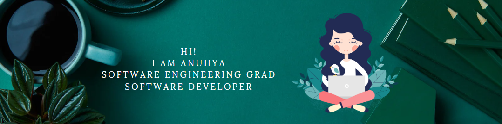

<h1> Hi there!  </h1>

👩🏾‍🎓 I am Spring 2023 Software Engineering graduate from San Jose State University.   
👩🏾‍💼 With more than 2 years of work experience as Software Developer from Adobe Systems, India.   
👩🏾‍💻 I have worked with - C, Java, Python, JavaScript, React, Node, Docker, AWS, Git, JIRA, HTML, CSS, Spring, Flask, APIs, MySQL, PostgreSQL. 
🙇🏾‍♀️ I want to create software projects that can positively impact the community.  
🙋🏾‍♀️ I am open to exploring new opportunities and meeting people.  
 
📔 My Academic Projects: <ol>
    <li> <a href="https://github.com/AnuhyaVenugopal/CMPE-MasterProject">Playpal, an online sports community.</a></li>
    <li> <a href="https://github.com/AnuhyaVenugopal/InnKeeper-CMPE-202">InnKeeper, a hotel booking application.</a></li>
    <li> <a href="https://github.com/AnuhyaVenugopal/CMPE-202-individual-project">Stock Inventory.</a></li>
    <li> <a href="https://github.com/sjsucmpe272-fall21/Investor-Protector">Investor-Protector.</a></li>
</ol>

